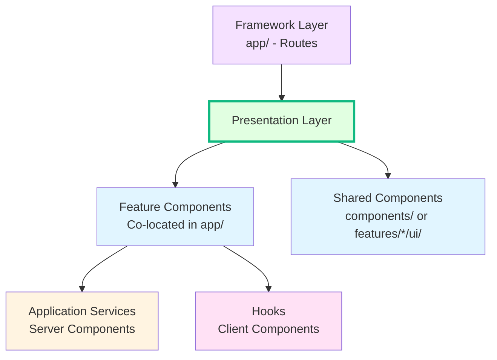

# Presentation Layer (Components, Hooks, Providers)

> **The UI layer.** Contains all React components, hooks, and providers that make up the visual interface. Components consume domain entities as data and use hooks/providers for client-side state.

---

## Architecture Evolution

The codebase is evolving to a **feature-based structure**. In the target architecture:

- Feature-specific components live in `src/features/{feature}/ui/`
- The **core** feature holds shared UI: layout, primitives (shadcn), Icon, Pagination, ErrorPage

See [DDD & Clean Architecture Refactor Plan](../../docs/architecture/DDD_CLEAN_ARCHITECTURE_REFACTOR_PLAN.md) and [Bounded Contexts](../../docs/architecture/BOUNDED_CONTEXTS.md) for the full target structure.

**Current state**: Components use `components/ui/`, `components/common/`, `components/layout/`. These will move into features post-refactor.

---

## Architecture Position



---

## Purpose

The `components/`, `hooks/`, and `providers/` directories together form the **presentation layer**. They define **how things look and feel** — rendering, interactivity, animations, and state management.

---

## Current Directory Structure

```
src/
├── components/
│   ├── ui/               # Primitive components (Button, Card, Dialog - shadcn/radix)
│   ├── common/           # Shared business components (ProductCard, CartDrawer)
│   └── layout/           # Layout components (Header, Footer, Container, Hero)
├── hooks/                # Custom React hooks
│   ├── useCart.ts
│   ├── useProducts.ts
│   ├── useUser.ts
│   ├── useTheme.ts
│   └── usePagination.ts
├── providers/            # React Context providers
│   ├── Providers.tsx     # Root provider composition
│   ├── CartProvider.tsx
│   ├── ThemeProvider.tsx
│   └── UserProvider.tsx
└── lib/
    ├── types.ts          # UI-specific types (NavigationItem, ViewMode, etc.)
    ├── icons.tsx          # Icon definitions
    ├── navigation.tsx     # Navigation config
    ├── constants.ts       # Static content / mock data
    ├── theme.ts           # Theme configuration
    └── utils.ts           # Utility functions
```

**Target structure (post-refactor)**:
- `components/common/ProductCard`, `Price`, etc. → `features/catalog/ui/`
- `components/common/CartDrawer` → `features/cart/ui/`
- `components/layout/` → `features/core/ui/layout/`
- `components/ui/` → **KEEP** at `src/components/ui/` (shadcn CLI default path for `npx shadcn add`)

---

## Import Rules

### ✅ Allowed Imports

| Source                                    | Why                                                 |
| ----------------------------------------- | --------------------------------------------------- |
| `react`, `next`, `next-intl`              | This IS the React layer                             |
| `@/domain/entities/*` or `@/features/*/domain/*` | Components use entity types for props and display   |
| `@/domain/types/*` or `@/features/administration/domain/types/*` | For DTOs like ProductInput                   |
| `@/lib/*`                                 | UI utilities, types, constants, icons               |
| `@/components/*`                          | Components compose other components                 |
| `@/hooks/*`, `@/providers/*`              | Components use hooks and consume context            |
| `@/application/actions/*`                 | Client components call server actions for mutations |
| `@/application/services/interfaces/*`     | For typing (e.g., service return types in props)    |
| shadcn/ui components (`@/components/ui/`) | Primitive UI building blocks                        |

### ❌ Forbidden Imports

| Source                                  | Why                                                        |
| --------------------------------------- | ---------------------------------------------------------- |
| `@/infrastructure/*`                    | Components must NEVER touch databases, repos, or DI        |
| `@/application/services/ProductService` | Don't import concrete service classes — use hooks or props |
| `@/server/getServices`                  | This is for Server Components in `app/` only               |
| `drizzle-orm`, database drivers         | Database is an infrastructure concern                      |

---

## Co-location Strategy

Place components **as close as possible to where they are used**:

1. **Route-Specific**: Only used in one page → put it in that page's folder (`_components/` or co-located)
2. **Group-Specific**: Used across pages in a group (e.g., `(shop)`) → `_components/` in that group
3. **Feature-Specific**: Used across a feature → `features/{feature}/ui/` (post-refactor)
4. **Global/Shared**: Used everywhere → `components/ui` or `features/core/ui/` (layout, primitives)

---

## Component Types

### Server Components (Default)

```tsx
// app/[locale]/(shop)/product/[id]/page.tsx
export default async function ProductPage({ params }: Props) {
  const { id } = await params;
  const { productService } = getServices(); // Direct service access
  const product = await productService.getById(parseInt(id));
  return <ProductDetail product={product} />;
}
```

### Client Components

```tsx
// app/[locale]/(shop)/product/[id]/ProductActions.tsx
'use client';
export function ProductActions({ product }: { product: Product }) {
  const { addToCart } = useCart();
  return <Button onClick={() => addToCart(product)}>Add to Cart</Button>;
}
```

### Shared Components (`src/components/`)

- **`ui/`**: Low-level primitives (shadcn). Pure UI, no domain logic
- **`common/`**: Domain-aware shared components (`Price`, `ProductCard`)
- **`layout/`**: Header, Footer, Sidebar

---

## DOs ✅

- **Use domain entities as prop types** — components work with business data, not database shapes
- **Use hooks for client-side state** (`useCart`, `useUser`, `useProducts`)
- **Call Server Actions from client components** for mutations
- **Keep `ui/` components generic** — no business-specific props
- **Separate server and client components clearly** — push `'use client'` down to the smallest interactive leaves

## DON'Ts ❌

- **DON'T import from infrastructure** — data flows through props (server) or hooks (client)
- **DON'T import concrete service classes** — use hooks or receive data via props
- **DON'T mix business logic into components**:
  ```typescript
  // ❌ Price calculation in component
  // ✅ Use: const entity = new ProductEntity(product); entity.getDiscountPercentage();
  ```
- **DON'T create `ui/` components with business-specific props** — those belong in `common/`

---

## Adding a New Component — Checklist

1. If it's a **primitive/generic** (shadcn) component → `components/ui/` — **always keep here** for CLI consistency
2. If it's a **shared business** component → `components/common/` or `features/{feature}/ui/` (post-refactor)
3. If it's a **layout** component → `components/layout/` or `features/core/ui/layout/` (post-refactor)
4. If it needs **client-side state** → create a hook in `hooks/`
5. If it needs **context** → create/update a provider in `providers/`
6. Add any new **UI-specific types** to `lib/types.ts`
7. **Never** import from `infrastructure/` — receive data via props or hooks
