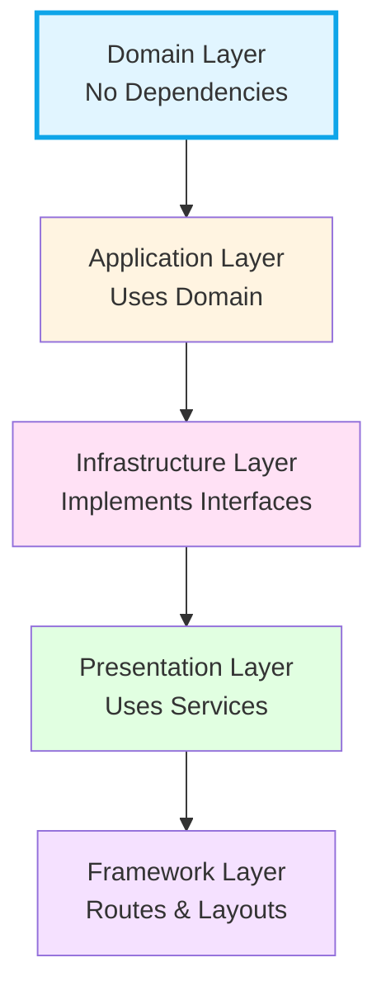

# 🔵 Domain Layer

> **The innermost layer.** Contains core business logic and entities with **zero dependencies** on any framework, library, or outer layer.

---

## Architecture Position



**Key Rule**: Domain Layer has NO outward dependencies. It's the foundation everything else builds upon.

---

## Purpose

The `domain/` layer defines **what the business IS** — its entities, value objects, and business rules. Code here should be portable: if you migrated from Next.js to Express, from PostgreSQL to MongoDB, or from React to Vue — **nothing in this layer should change**.

---

## Directory Structure

```
domain/
├── entities/          # Business entities (Product, Cart, Category, etc.)
│   └── index.ts       # Barrel export for all entities
└── types/
    └── admin.ts       # DTOs shared across layers (AdminProductInput, SessionPayload, etc.)
```

---

## Import Rules

### ✅ Allowed Imports

| Source                      | Why                                        |
| --------------------------- | ------------------------------------------ |
| Other `domain/` files       | Entities can reference each other          |
| Standard TypeScript/JS APIs | `Date`, `Math`, `JSON`, `Map`, `Set`, etc. |

### ❌ Forbidden Imports

| Source                            | Why                                                  |
| --------------------------------- | ---------------------------------------------------- |
| `react`, `next`, `next-intl`      | Domain must be framework-agnostic                    |
| `@/application/*`                 | Domain doesn't know about services or use cases      |
| `@/infrastructure/*`              | Domain doesn't know about databases, ORMs, or APIs   |
| `@/components/*`, `@/hooks/*`     | Domain doesn't know about the UI                     |
| `@/lib/*`                         | Lib contains UI utilities (icons, navigation, theme) |
| `drizzle-orm`, `bcryptjs`, `jose` | Implementation details belong in infrastructure      |

---

## Key Entities

### Product Entity

**Location**: `src/domain/entities/Product.ts`

Represents a product with business logic for price calculations, stock checking, and discounts.

```typescript
import { ProductEntity, type Product } from '@/domain/entities/Product';

const product = new ProductEntity(productData);

// Calculate price with variant selections
const finalPrice = product.calculatePrice({ 'Pack Size': '24-pack' });

// Check stock and discounts
const inStock = product.isInStock(variantSelections);
if (product.hasDiscount()) {
  const discountPercent = product.getDiscountPercentage();
}
```

**Business Methods**: `calculatePrice()`, `isInStock()`, `hasDiscount()`, `getDiscountPercentage()`, `getData()`

### Cart Entity

**Location**: `src/domain/entities/Cart.ts`

Manages shopping cart operations: add/remove items, update quantities, calculate totals.

```typescript
import { CartEntity, type CartItem } from '@/domain/entities/Cart';

const cart = new CartEntity();
const items = cart.addItem(product, 2, { Color: 'blue' });
const totalPrice = cart.getTotalPrice();
```

**Business Methods**: `addItem()`, `removeItem()`, `updateItemQuantity()`, `getTotalItems()`, `getTotalPrice()`, `clear()`, `getItems()`

---

## DOs ✅

### DO: Keep entities as pure TypeScript interfaces + classes

```typescript
// ✅ GOOD — Pure TypeScript, no external dependencies
export interface Product {
  id: number;
  name: string;
  price: number;
  strikePrice?: number;
}

export class ProductEntity {
  constructor(private product: Product) {}

  hasDiscount(): boolean {
    return !!this.product.strikePrice && this.product.strikePrice > this.product.price;
  }
}
```

### DO: Define DTOs for cross-layer inputs

```typescript
// ✅ GOOD — in domain/types/admin.ts
export interface AdminProductInput {
  price: number;
  translations: { language: string; name: string; description: string }[];
}
```

### DO: Put business validation in entities

```typescript
export class CartEntity {
  isInStock(variantSelections?: { [key: string]: string }): boolean {
    // Pure business logic — no DB calls, no API calls
  }
}
```

### DO: Export all entities from the barrel file

```typescript
// domain/entities/index.ts
export * from './Product';
export * from './Cart';
export * from './Category';
```

---

## DON'Ts ❌

### DON'T: Import React or any UI framework

```typescript
// ❌ BAD — React has no place in the domain
import React from 'react';
export interface NavigationItem {
  icon?: React.ReactNode; // This is a UI concern!
}
```

Use `string` for icon names; let the presentation layer resolve them to components.

### DON'T: Import database libraries

```typescript
// ❌ BAD — ORM is an infrastructure detail
import { pgTable, serial, text } from 'drizzle-orm/pg-core';
```

Database schemas belong in `infrastructure/database/schema/`.

### DON'T: Put UI/presentation types here

```typescript
// ❌ BAD — These are UI concerns
export type ViewMode = 'grid' | 'list';
export type SortOption = 'featured' | 'newest' | 'price-asc' | 'price-desc';
```

→ These belong in `src/lib/types.ts`

---

## Design Principles

1. **No Dependencies**: Zero imports from any other layer
2. **Pure Business Logic**: Price calculations, validations — not DB queries or API calls
3. **Immutability**: Return new instances rather than mutating:
   ```typescript
   const updatedCart = cart.addItem(product, 1); // ✅ Returns new state
   cart.items.push(newItem); // ❌ Direct mutation
   ```
4. **Rich Domain Models**: Entities contain behavior, not just data:
   ```typescript
   const price = product.calculatePrice(variants); // ✅ Entity method
   const price = calculateProductPrice(product, variants); // ❌ External function
   ```

---

## Testing

Domain entities are easy to test because they have no dependencies:

```typescript
describe('ProductEntity', () => {
  it('should calculate price with variant modifier', () => {
    const product = new ProductEntity({
      id: 1,
      price: 100,
      variants: {
        Size: {
          name: 'Size',
          options: [{ value: 'large', label: 'Large', priceModifier: 20, stock: 10 }],
        },
      },
    });
    expect(product.calculatePrice({ Size: 'large' })).toBe(120);
  });
});
```

---

## Adding a New Feature — Checklist

1. **Define the entity** in `domain/entities/NewEntity.ts`
2. **Add it to the barrel** export in `domain/entities/index.ts`
3. If the feature needs input DTOs, add them to `domain/types/`
4. **Verify**: Does this file import anything outside `domain/`? If yes, you're breaking the rule.
