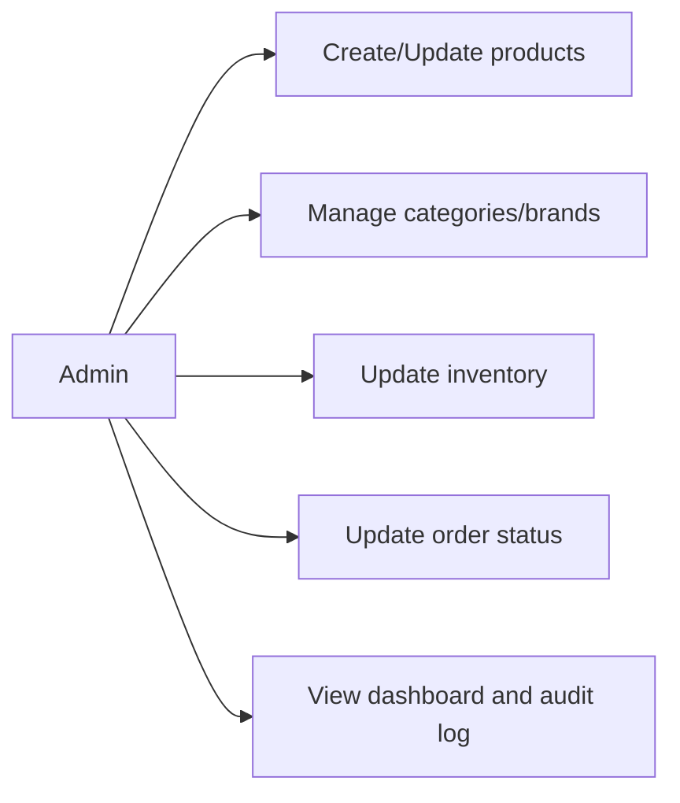
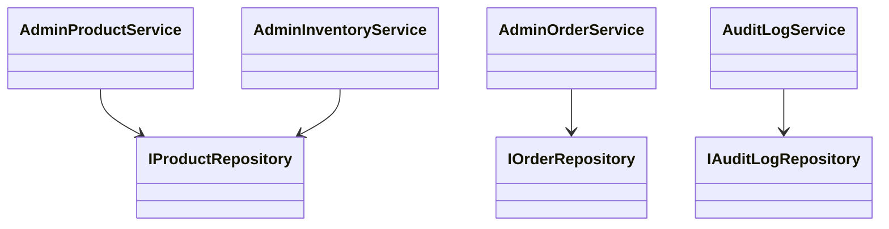
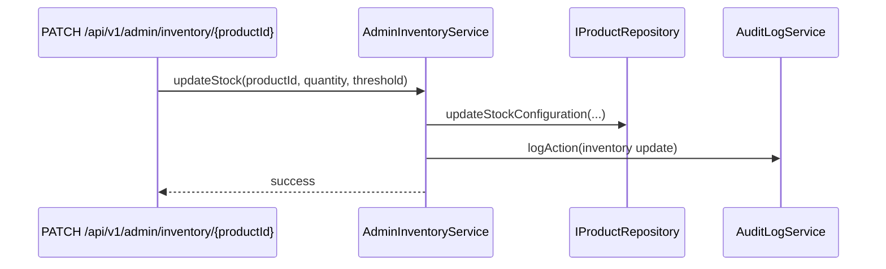

# Administration Feature

Owns back-office operations: catalog CRUD, inventory control, order operations, and auditability.

## Use Cases

## UML (Class View)

## Sequence (Inventory Update)

## Layer Notes

- `domain`: admin DTOs + `AuditLogEntry`.
- `application`: admin services with policy and validation.
- `infrastructure`: audit and persistence adapters.

## Clean Architecture Boundaries

- Depends on `catalog`, `order`, `identity` contracts, and `core`.
- All admin mutations should be auditable.
- Admin UI/actions should call services/contracts, not raw repositories.

## Presentation Mappers

The `presentation/mappers/` directory contains transformation
functions that convert domain objects into UI-ready shapes.

### Why Mappers Exist

Domain objects are designed for business logic — they carry
raw JSONB, domain methods, and business rules. UI components
need flat, typed, locale-resolved values.

Mappers are the bridge between these two worlds. They are the
ONLY place where:

- JSONB is unpacked into locale-specific strings
- Domain objects are transformed into form values or card props
- `product.getName(locale)` is called to resolve display text

### Current Mappers

| File                     | Transforms                      | Used By                 |
| ------------------------ | ------------------------------- | ----------------------- |
| `product-form-mapper.ts` | `Product` → `ProductFormValues` | Admin create/edit pages |

### Adding A New Mapper

When building a new admin feature that needs to pre-populate a
form or transform a domain object for display:

1. Create `presentation/mappers/your-entity-mapper.ts`
2. Import the domain entity type
3. Export a named `toYourEntityFormValues(entity)` function
4. Call domain entity locale methods — never unpack JSONB directly
5. Use `toEmptyYourEntityFormValues()` for create mode defaults
