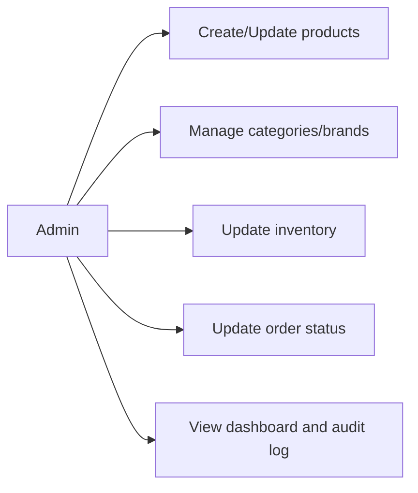
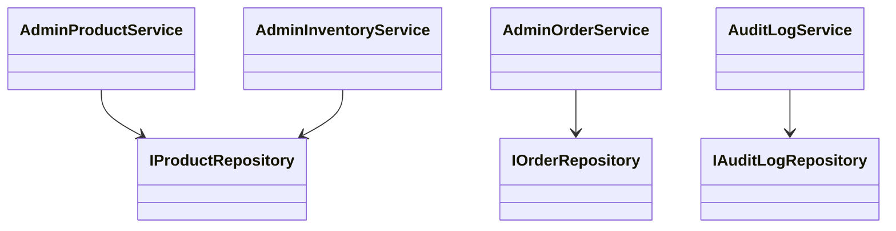
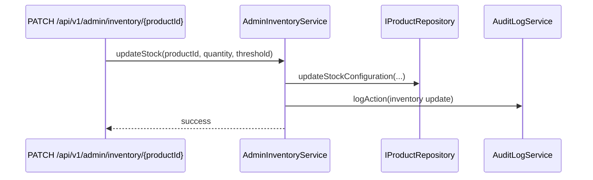

# Administration Feature

Owns back-office operations: catalog CRUD, inventory control, order operations, and auditability.

## Use Cases

## UML (Class View)

## Sequence (Inventory Update)

## Layer Notes
- `domain`: admin DTOs + `AuditLogEntry`.
- `application`: admin services with policy and validation.
- `infrastructure`: audit and persistence adapters.

## Clean Architecture Boundaries
- Depends on `catalog`, `order`, `identity` contracts, and `core`.
- All admin mutations should be auditable.
- Admin UI/actions should call services/contracts, not raw repositories.

