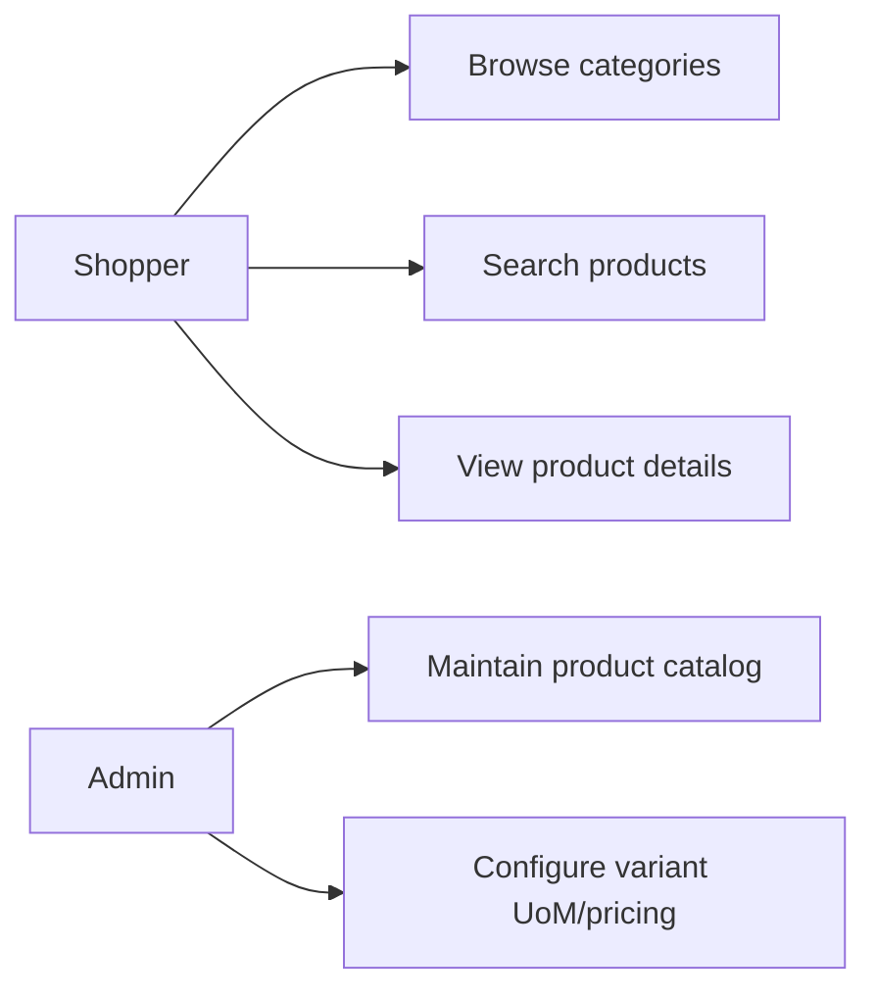
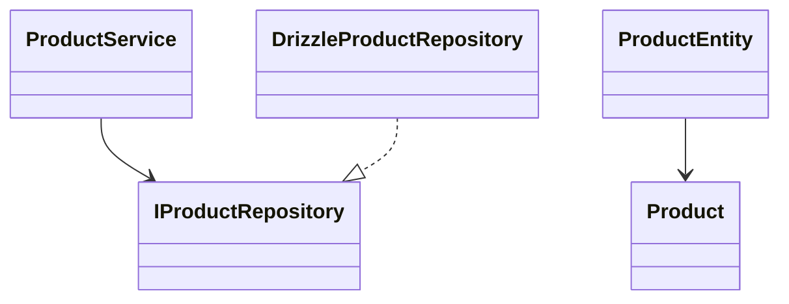
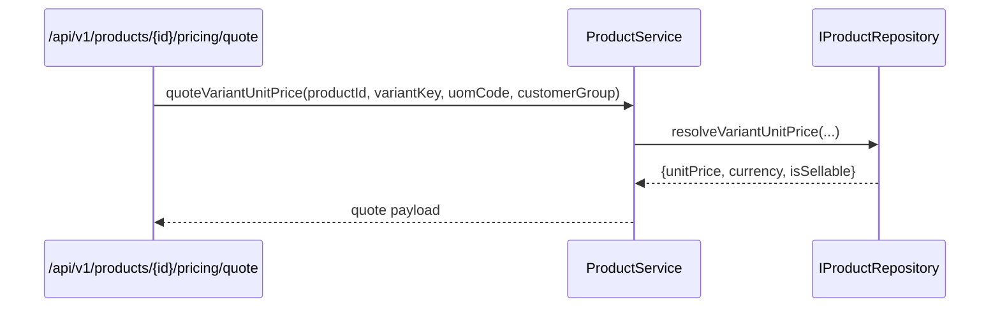

# Catalog Feature

Owns product discovery and commercial catalog data: products, categories, brands, and variant sell options.

## Use Cases

## UML (Class View)

## Sequence (Price Quote)

## Layer Notes

- `domain`: `Product`, `Category`, `Brand`, `ProductEntity`.
- `application`: service contracts and catalog use cases.
- `infrastructure`: Drizzle repositories and query composition.

## Clean Architecture Boundaries

- Depends on `core`.
- Used by `cart`, `order`, and `administration` through interfaces/services.
- No UI should import repository implementations directly.

## Localization Strategy

The catalog feature utilizes JSONB inline fields for localized content (e.g., `localizedName`, `localizedSlug`).
We do not use a separate translation table.

### The Repository Rule

Repositories in this feature are locale-unaware.
They return raw Product, Category, and Brand domain objects
with all JSONB fields intact.

Never add a `locale` parameter to a repository method for the
purpose of resolving display strings. If you feel the urge to
do this — the logic belongs in a domain entity method or a
presentation mapper instead.
