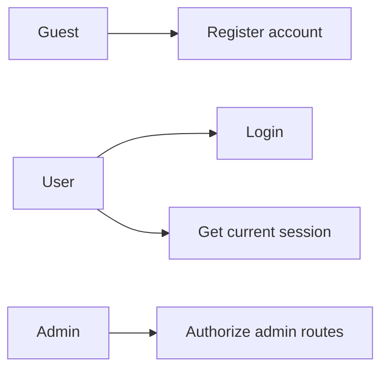
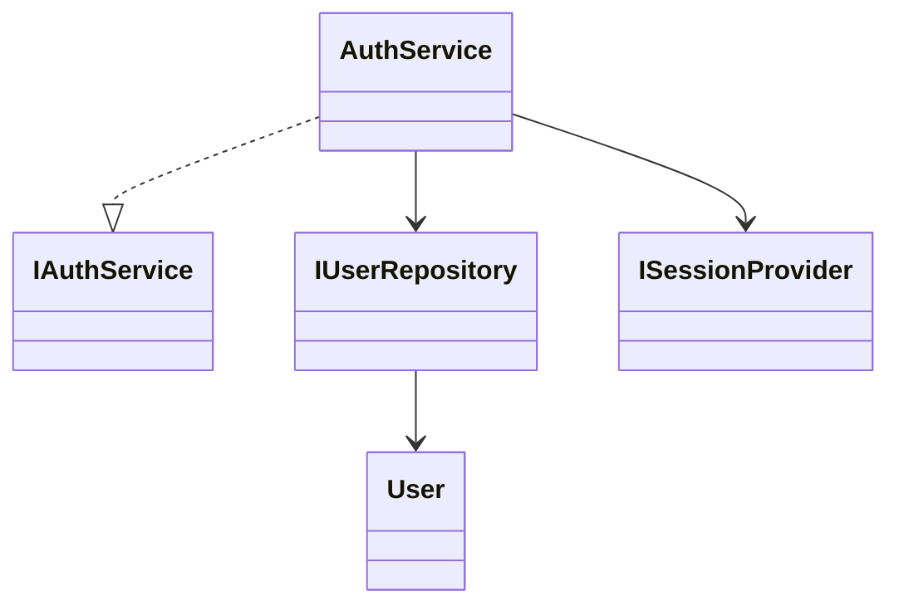
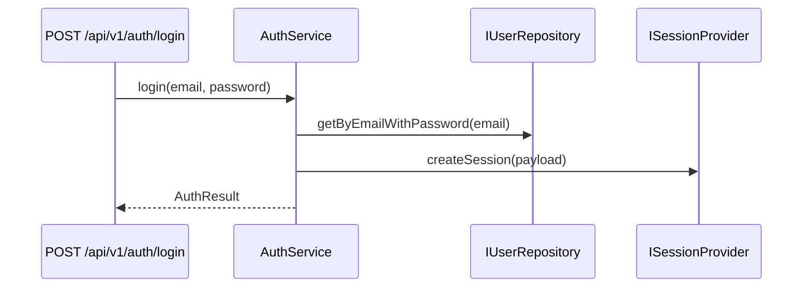

# Identity Feature

Owns authentication, registration, session boundaries, and user profile/address access.

## Use Cases

## UML (Class View)

## Sequence (Login)

## Layer Notes
- `domain`: user and auth/session DTO contracts.
- `application`: auth service and user repository ports.
- `infrastructure`: Drizzle user repository and JWT/cookie providers.

## Clean Architecture Boundaries
- Depends on `core` ports for session management.
- Used by all authenticated features.
- Route middleware should depend on session contracts, not repository internals.

