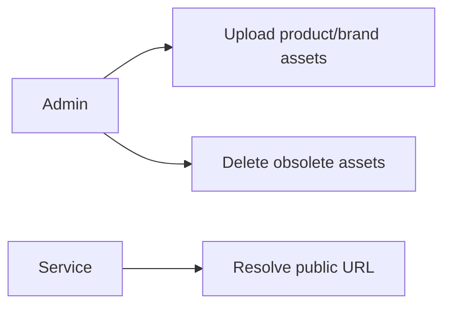
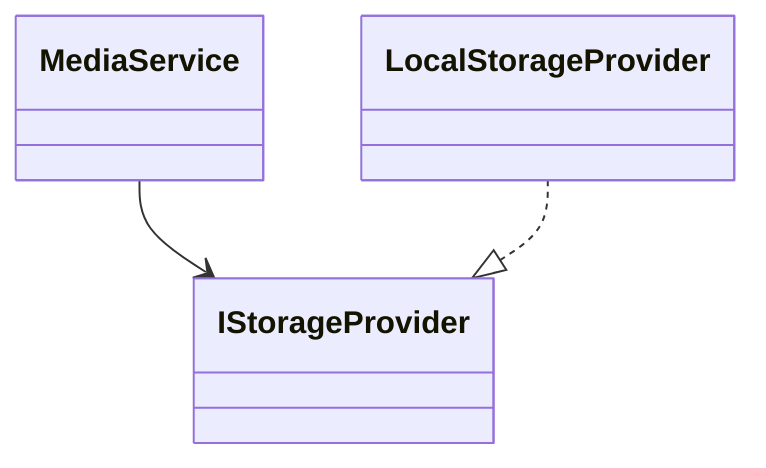
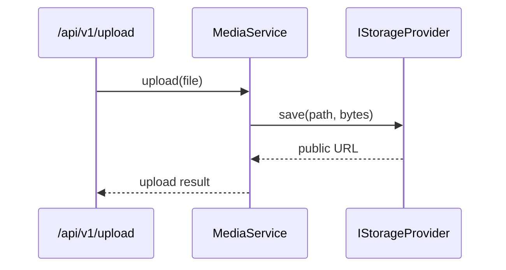

# Media Feature

Owns file upload/storage workflows and URL generation for assets used across features.

## Use Cases

## UML (Class View)

## Sequence (Upload)

## Layer Notes
- `application`: `MediaService` orchestration.
- `infrastructure`: storage provider adapters.

## Clean Architecture Boundaries
- Depends on `core` storage ports only.
- Catalog/admin features consume media URLs; they should not manage storage internals directly.

