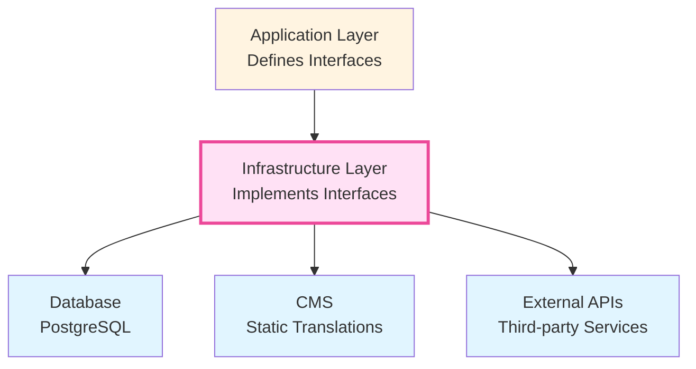

# 🟠 Infrastructure Layer

> **The outermost technical layer.** Provides concrete implementations of interfaces defined in the application layer. Contains all framework-specific, database-specific, and third-party integration code.

---

## Architecture Position



**Key Rule**: Infrastructure implements Application layer interfaces and handles all external concerns.

---

## Purpose

The `infrastructure/` layer defines **HOW things work** — database queries, session storage, CMS integration, and the dependency injection container. It depends **inward** on both `domain/` and `application/`, but nothing should depend on it except the DI container wiring and `server/getServices.ts`.

---

## Directory Structure

```
infrastructure/
├── auth/                    # Authentication implementations
│   └── CookieSessionProvider.ts
├── cms/                     # Content Management System integration
│   ├── client.ts
│   └── messages/
├── config/                  # Environment & database configuration
│   ├── cms.config.ts
│   └── database.config.ts
├── database/                # Database connection & schema
│   ├── index.ts
│   ├── drizzle.config.ts
│   └── schema/              # Drizzle ORM table definitions
├── di/                      # Dependency Injection container
│   └── ServiceContainer.ts
└── repositories/            # Repository implementations
    ├── DrizzleProductRepository.ts
    ├── DrizzleCategoryRepository.ts
    ├── DrizzleUserRepository.ts
    ├── DrizzleOrderRepository.ts
    ├── DrizzleReviewRepository.ts
    ├── MockProductRepository.ts
    ├── MockCategoryRepository.ts
    └── RepositoryFactory.ts
```

---

## Import Rules

### ✅ Allowed Imports

| Source                                       | Why                                                 |
| -------------------------------------------- | --------------------------------------------------- |
| `@/domain/entities/*`, `@/domain/types/*`    | Repos return domain entities and accept domain DTOs |
| `@/application/repositories/*`               | Repos implement these interfaces                    |
| `@/application/services/interfaces/*`        | ServiceContainer registers services via interfaces  |
| `@/application/services/*` (implementations) | ServiceContainer instantiates concrete services     |
| `drizzle-orm`, database drivers              | Repos use ORMs for data access                      |
| `jose`, `bcryptjs`, `next/headers`           | Auth providers use cryptographic libraries          |

### ❌ Forbidden Imports

| Source                        | Why                                            |
| ----------------------------- | ---------------------------------------------- |
| `@/components/*`, `@/hooks/*` | Infrastructure has no UI concerns              |
| `@/app/*`                     | Infrastructure doesn't know about routes/pages |
| `@/providers/*`               | React context providers are a UI concern       |
| `react`, `next/navigation`    | Rendering and routing are UI layer concerns    |

---

## Key Concepts

### Database Repositories

```typescript
import type { IProductRepository } from '@/application/repositories/IProductRepository';
import type { Product } from '@/domain/entities/Product';

export class DatabaseProductRepository implements IProductRepository {
  async getAll(language: string = 'en'): Promise<Product[]> {
    const result = await db
      .select({ product: products, translation: productTranslations })
      .from(products)
      .leftJoin(
        productTranslations,
        and(
          eq(productTranslations.productId, products.id),
          eq(productTranslations.language, language),
        ),
      );
    return result.map((row) => this.mapToDomain(row.product, row.translation));
  }

  // Map database model → domain entity
  private mapToDomain(dbProduct: any, translation?: any): Product {
    return {
      id: dbProduct.id,
      name: translation?.name || dbProduct.name,
      price: dbProduct.price,
      // ...
    };
  }
}
```

### Repository Factory

```typescript
export class RepositoryFactory {
  static createProductRepository(): IProductRepository {
    return process.env.USE_DATABASE === 'true'
      ? new DatabaseProductRepository()
      : new MockProductRepository();
  }
}
```

### Dependency Injection Container

```typescript
export class ServiceContainer {
  private static instance: ServiceContainer;

  private constructor() {
    const productRepository = RepositoryFactory.createProductRepository();
    this.productService = new ProductService(productRepository);
  }

  static getInstance(): ServiceContainer {
    /* singleton */
  }

  get productService(): IProductService {
    /* lazy getter typed to interface */
  }
}
```

---

## DOs ✅

- **Implement application interfaces** — don't invent new contracts
- **Map database rows to domain entities** with `toDomainEntity()` mappers
- **Type ServiceContainer getters to interfaces**, not concrete classes
- **Keep configuration centralized** in `infrastructure/config/`
- **Handle translations** in repositories (load with entity data)

## DON'Ts ❌

- **DON'T import infrastructure in application or domain layers**
- **DON'T return database-specific types** from repositories:
  ```typescript
  // ❌ async getAll(): Promise<typeof productsTable.$inferSelect[]>
  // ✅ async getAll(): Promise<Product[]>
  ```
- **DON'T let multiple files create repository/service instances** — only in `ServiceContainer.ts`
- **DON'T hard-code secrets or config values** — use environment variables

---

## Database Schema

Schemas use Drizzle ORM (`src/infrastructure/database/schema/`):

- **Products table** — base product info (price, category, images, variants as JSONB)
- **Product Translations table** — language-specific name/description (one row per product per language)
- **Relations** — defined via Drizzle `relations()` for type-safe joins

---

## Adding a New Feature — Checklist

1. **Create the database schema** in `infrastructure/database/schema/newTable.ts`
2. **Create the repository implementation** in `infrastructure/repositories/DrizzleNewRepository.ts`
3. Ensure it `implements` the interface from `application/repositories/`
4. **Register it** in `infrastructure/di/ServiceContainer.ts` — add as private field typed to interface + lazy getter
5. Include a `toDomainEntity()` mapper to translate DB rows → domain entities
